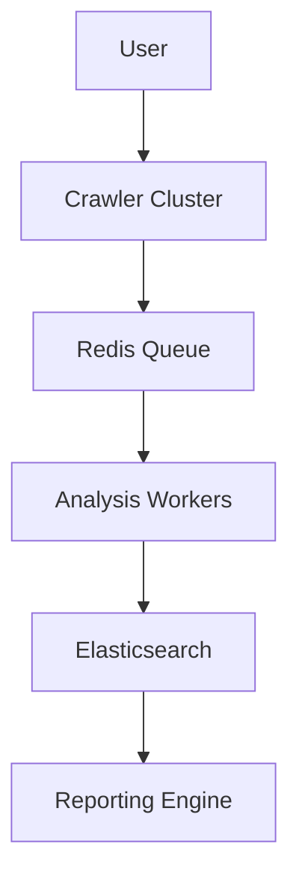

# ScanTrek Documentation

## Table of Contents
1. [Overview](#overview)
2. [Installation](#installation)
3. [Configuration](#configuration)
4. [Usage](#usage)
5. [Architecture](#architecture)
6. [Security](#security)
7. [API Reference](#api-reference)
8. [Examples](#examples)
9. [Troubleshooting](#troubleshooting)
10. [Contributing](#contributing)
11. [License](#license)

---

## <a name="overview"></a>1. Overview

### What is ScanTrek?
An AI-powered web reconnaissance framework for identifying sensitive data exposure across web assets.

**Key Features**:
- 🕸️ Intelligent website crawling
- 🔍 150+ built-in detection patterns
- ⚡ Distributed processing
- 🕵️ Stealth operation modes
- 📊 Compliance-ready reporting

---

## <a name="installation"></a>2. Installation

### Requirements
- Python 3.9+
- Redis 6.0+
- Docker (optional)

### Methods
```bash
# PyPI Install
pip install ScanTrek

# Docker
docker pull ScanTrek/core:latest

# Source Build
git clone https://github.com/D3crypT0r/ScanTrek
python setup.py install

###<aname="overview"> </a> 1. Overview

### What is ScanTrek?
An AI-powered web reconnaissance framework for identifying sensitive data exposure across web assets.

**Key Features**:
- 🕸️ Intelligent website crawling
- 🔍 150+ built-in detection patterns
- ⚡ Distributed processing
- 🕵️ Stealth operation modes
- 📊 Compliance-ready reporting

---

## <a name="installation"> </a> 2. Installation

### Requirements
- Python 3.9+
- Redis 6.0+
- Docker (optional)

### Methods
```bash
# PyPI Install
pip install ScanTrek

# Docker
docker pull ScanTrek/core:latest

# Source Build
git clone https://github.com/D3crypT0r/ScanTrek
python setup.py install
```

---

## <a name="configuration"></a>3. Configuration

### Core Settings (`config.yaml`)
```yaml
crawler:
  max_depth: 5
  stealth_mode: true
  parallel_workers: 10

analysis:
  file_types:
    documents: [pdf, docx, xlsx]
    code: [js, env, config]
  sensitivity_threshold: 0.85

reporting:
  formats: [json, html]
  redaction: partial
```

### Pattern Management
```yaml
# custom-patterns.yaml
- name: "internal_api_key"
  pattern: "ak-[a-z0-9]{32}"
  confidence: 0.95
  context: ["api", "auth"]
```

---

## <a name="usage"></a>4. Usage

### CLI Commands
```bash
# Basic scan
ScanTrek -t https://example.com -o ./results

# Distributed mode
ScanTrek --role crawler --nodes 5
ScanTrek -t https://example.com --distributed

# Custom patterns
ScanTrek --patterns custom-rules.yaml
```

### Common Options
```
-t, --target       Target URL
-d, --depth        Crawl depth (default: 3)
-o, --output       Output directory
--stealth          Enable anti-detection
--distributed      Enable cluster mode
```

---
## <a name="architecture"></a>5. Architecture



**Components**:
- **Crawler Cluster**: URL discovery and content collection
- **Analysis Workers**: File processing and pattern matching
- **Storage Layer**: Redis + Elasticsearch
- **Reporting**: JSON/HTML/CSV outputs

---

## <a name="security"></a>6. Security

### Protocols
- AES-256 encrypted storage
- Automatic PII redaction
- Ephemeral temporary files
- TLS 1.3 communications

---

## <a name="api-reference"></a>7. API Reference

### Core Classes
```python
class ScanTrek:
    def start(self):
        """Begin crawling process"""

class PatternManager:
    def load_custom(self, path: str):
        """Load detection rules"""
```

### Web API Endpoints
```
GET /api/v1/scan?target=URL
POST /api/v1/patterns
```

---

## <a name="examples"></a>8. Examples

### Basic Scan
```bash
ScanTrek -t https://test.com -d 2 --stealth
```

### Custom Pattern
```yaml
- name: "jwt_token"
  pattern: "eyJ[A-Za-z0-9-_=]+"
  confidence: 0.9
```

### Kubernetes Deployment
```yaml
apiVersion: apps/v1
kind: Deployment
spec:
  containers:
  - name: crawler
    image: ScanTrek/core:latest
```

---

## <a name="troubleshooting"></a>9. Troubleshooting

**Issue**: Blocked by WAF
- ✅ Enable stealth mode
- ✅ Rotate user agents
- ✅ Use proxy rotation

**Issue**: High Memory Usage
- ✅ Reduce parallel workers
- ✅ Limit file size (-m 25)
- ✅ Enable stream mode

---

## <a name="contributing"></a>10. Contributing

1. Fork the repository
2. Create feature branch
3. Submit PR with:
   - Code changes
   - Unit tests
   - Documentation updates

**Standards**:
- PEP8 compliance
- Type hints required
- 85%+ test coverage

---

## <a name="license"></a>11. License

GNU Affero General Public License v3.0

```


